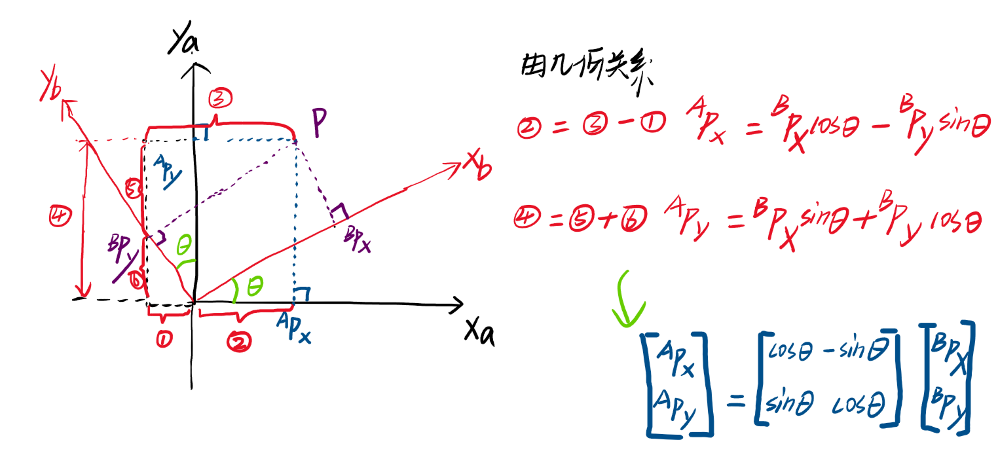
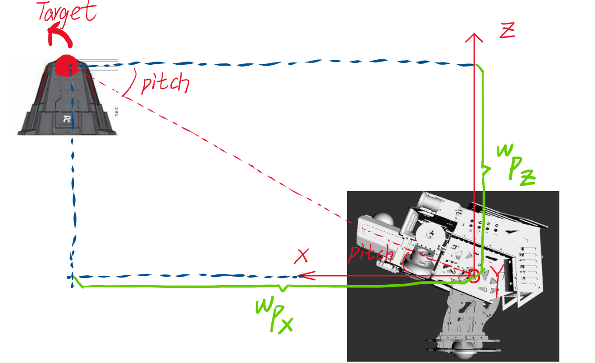
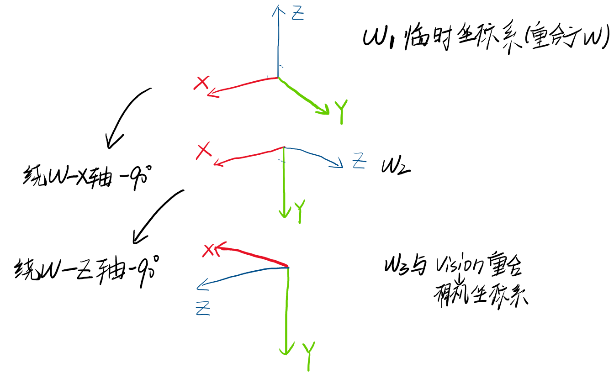

# Robomaster AutoAim Transform

# **Basic**
## **Simple 1D Example**  
### **Introduction**
让我们先回顾一下小学时候学习的一维坐标轴。设一个坐标轴$X$上有四个点，分别为`A`,`B`,`C`,`D`. 他们四个本身只有一个相对位置，其实没有一个确切的**坐标系**，而**坐标系**的概念是人们定义的一个**数学定义**，**坐标系**给定一个坐标系原点`O`.然后其他`A`,`B`,`C`,`D`四个点都有了一个坐标。但是`O`只是人为定义的一个点，所以其实可以设置在任何地方，而随着`O`坐标原点的变化，`A`,`B`,`C`,`D`坐标也会变化。所以**坐标**只是一种数学描述。但不管怎么设置`O`，四者的相对位置都是不变的。[如下图所示](#img-1DExp-OriginPt) ，给出了`A`,`B`,`C`,`D`的坐标表示，但这个其实都是以`O`为参照点而得出的坐标。那同理`A`-`D`四点也都可以组建自己的坐标系，以自己为原点来评判他人。      
<a id="img-1DExp-OriginPt"></a>  
      

### **Translation**
这里增加一个定义: 平移向量 ${}^{M}_{N}t$ (标量可理解成1D的向量). 具体含义为将**坐标系$M$** 移动到与**坐标系$N$** 重合所产生的平移向量。例如**坐标系$O$** 到**坐标系$A$**需要向**右**移动**2**个单位。因此${}^{O}_{A}t = 2$. 然后这个${}^{O}_{A}t = 2$可以用来做两个坐标系的坐标转换，虽然我们这里只是1D环境。**当用作坐标转换时，${}^{O}_{A}t$，表示将坐标系 $A$ 中的点 $P$ 作用这个 translation 后(作用平移向量规定为+)得到该点 $P$ 在坐标系$O$中的坐标。**  

然后相同一个实际的点在两个坐标系中会出现两个坐标.就以点`C`举个例子，左上角表示的是**坐标系**，标注方法参考机器人学导论。  
- 点`C`在**坐标系$O$** : ${}^OX_{C} = 4$
- 点`C`在**坐标系$A$** : ${}^AX_{C} = 2$  
- 平移向量作用  ${}^OX_{C} = {}^{O}_{A}t + {}^AX_{C}$     
- 有个我理解的记忆方式，就是$A$到$O$的平移向量就记忆成$A$在上$O$在下。形成平移向量${}^{O}_{A}t$。然后坐标转换时候，平移向量始终放左边。这样就可以看成把左下$A$和右上$A$消掉了。下面2D和3D同理。  

### **小结**
结合这个小栗子，虽然比较啰嗦，但希望能记住以下三个核心观点。  
- **坐标**只是一种数学描述方式，具体数值是取决于参考的坐标系。但是在真实世界中静止物体的相对位置是固定的（忽略地球公转、自转、大风吹动等因素）
- ${}^{O}_{A}t$
  - 表示 **坐标系$O$** 经过这样的转换可以与 **坐标系$A$** 重合
  - 但实际转换时，是在 **坐标系$A$** 中的坐标$X_A$做这样的 **translation**后得到该点在 **坐标系$O$** 的坐标。
- **坐标转换** 是为了得到**特定坐标系**下的**坐标**

## **2D 平面坐标系**
### **$X-Y$(笛卡尔坐标系)**
没什么好说的，就是平面坐标系。但是要类比，这里把`Z`轴设置在原点竖直向上。然后该坐标系中的某个点 $P = [x,y]^T$,这里设为$P = [3,3]^T$.额XY写反了，懒得改了，先这样吧   
  

### **Translation (平移)**   
现有两个**坐标系$A$** 和**坐标系$B$**，如下图所示，这样的话相同位置 **(黑点与红×交会点处)** 便有了两套坐标：${}^AP=[{}^Ax,{}^Ay]^T$ 和 ${}^BP=[{}^Bx,{}^By]^T$。
  

#### **求${}^A_Bt$**    
通过图可看出**坐标系$A$** 经过**向右移动一个单位**和**向上移动二个单位**后与**坐标系$B$** 重合（这里移动的方向其实是以**坐标系$A$** 为基准的）。因此${}^A_Bt$如下所示：  
$${}^A_Bt = [1，2]^T$$  
然后就是`translation`变换的关系满足下式：  
$$[3,3]^T={}^AP={}^A_Bt+{}^BP = [1，2]^T + [2，1]^T$$

​    

#### **再求${}^B_At$**   
这个就很简单了，在这种情况下很简单就是单纯取符号，但这个相对的平移矩阵的求解其实没那么简单，因为这里没旋转，坐标系$A$ 和坐标系$B$ 的$X-Y-Z$防线那个都一致。如果除了平移再加上坐标系旋转就不是这么简单了。后面再详细说。这里要注意一下.


### **Rotation (旋转)**    
上述介绍了二维平面的平移变换`translation`，那当然能平移就能旋转`rotation`，也就是$XY$平面绕坐标轴`Z`旋转。<font color = "red">旋转满足右手定则，即右手大拇指朝向Z轴正轴方向，然后四指弯曲方向就是旋转正方向</font>。然后旋转的数学表示有三种，即**Euler(欧拉角)**、**Rotation Matrix（旋转矩阵**）和 **Quaternion（四元数）**。 

#### **Euler（欧拉角**）  
最容易理解的旋转,这里先不扩展，单说绕`Z`轴旋转，那么旋转的$\theta$便是欧拉角中的一个。

虽然方便于我们大脑的理解，但是对于数学来说比较抽象，因为坐标转换主要关注的是**坐标**，而**欧拉角**与**坐标**难以直接进行加减乘除计算。因此引入**旋转矩阵**进行坐标转换。     

#### **Rotation Matrix（旋转矩阵）**  
首先还是给个定义。当**坐标系$A$** 经过一系列旋转后与**坐标系$B$** 重合，那么便可以得到一个旋转矩阵，一般记为${}_B^AR$. 那么同理相同的一个点$P$在两个坐标系中个有一个坐标，分别为${}^AP=[{}^Ax,{}^Ay]^T$ 和 ${}^BP=[{}^Bx,{}^By]^T$ 三者的关系按这个上面同理。就可以将**坐标系$B$**中的某点坐标转换到**坐标系$A$**中。    
$${}^AP = {}_B^AR \cdot {}^BP$$  
<font color = 'red'>这里需要是左乘${}_B^AR$，有物理意义的，我们的应用场景一般就是左乘，所以不赘述右乘和左乘的区别了。</font>  
所以那么问题来了，这个旋转矩阵怎么求呢，一种方式是可以通过几何关系推理关系，如下图所示:  
    
可以设置一个例子，算算看看对不对,例如${}^AP = [1,2], \theta=30°$    

#### **Quaternion（四元数）**  
二维就先不说这个了，三维场景再说。 要知道的就是上面的欧拉角和旋转矩阵可以相互转换，然后四元数与那两者也有转换公式和关系。   

### Transform(Rotation + Transition)  
`Rotation`+`Transition`共同作用一般称为坐标转换`Transform`.但是这个又有了个问题那便是  
- `Transition`是左加法  
- `Rotation`是左乘法  

当作用于坐标进行坐标转换时一个加法一个乘法所以很不美观，大佬们就想了方法将他们集成到一起。  

**首先**，将上述的`Transition` ${}^AP={}^A_Bt+{}^BP$转换为矩阵乘法。
原来加法如下:    
$$
\begin{bmatrix}
{}^AP_x  \\
{}^AP_y  \\
\end{bmatrix}
= 
\begin{bmatrix}
{}^A_Bt_x \\
{}^A_Bt_y 
\end{bmatrix}
+
\begin{bmatrix}
{}^BP_x  \\
{}^BP_y  \\
\end{bmatrix}
$$

解决方法就是扩维度，不解释了，直接看结果,是不是很巧妙。  

$$
\begin{bmatrix}
{}^AP_x  \\
{}^AP_y  \\
1
\end{bmatrix}
=
\begin{bmatrix}
1 & 0 & {}^A_Bt_x \\
0 & 1 & {}^A_Bt_y \\
0 & 0 & 1
\end{bmatrix}
\cdot
\begin{bmatrix}
{}^BP_x  \\
{}^BP_y  \\
1
\end{bmatrix}
$$

然后这样的话还有一个顺序其实，**先旋转再平移**与**先平移在旋转**是不一样的，但可以简单理解成**平移附加的是加法作用**，而**旋转附加的是左乘作用**，因此我们这里的作用都是以 **先旋转再平移为准**，因此即便上面的加法转换为了左乘法也是需要在旋转作用之后再作用。又因为平移扩维度了，所以2D维度的旋转矩阵也扩一下维度，z轴坐标不动。因此  

$$
\begin{bmatrix}
{}^AP_x  \\
{}^AP_y  \\
1\\
\end{bmatrix}
=
\begin{bmatrix}
cos\theta & -sin\theta & 0 \\
sin\theta & cos\theta & 0 \\
0 & 0 & 1
\end{bmatrix}
\cdot
\begin{bmatrix}
{}^BP_x  \\
{}^BP_y  \\
1
\end{bmatrix}
$$

然后将`Rotation`与`Transition`结合在一起得到如下所示， **先旋转再平移为准** 哪个先就先左乘:  

$$
\begin{bmatrix}
{}^AP_x  \\
{}^AP_y  \\
1\\
\end{bmatrix}
=
\begin{bmatrix}
1 & 0 & {}^A_Bt_x \\
0 & 1 & {}^A_Bt_y \\
0 & 0 & 1
\end{bmatrix}
\cdot
\begin{bmatrix}
cos\theta & -sin\theta & 0 \\
sin\theta & cos\theta & 0 \\
0 & 0 & 1
\end{bmatrix}
\cdot
\begin{bmatrix}
{}^BP_x  \\
{}^BP_y  \\
1
\end{bmatrix}
$$

计算得到  

$$
\begin{bmatrix}
{}^AP_x  \\
{}^AP_y  \\
1\\
\end{bmatrix}
=
\begin{bmatrix}
cos\theta & -sin\theta & {}^A_Bt_x \\
sin\theta & cos\theta & {}^A_Bt_y \\
0 & 0 & 1
\end{bmatrix}
\cdot
\begin{bmatrix}
{}^BP_x  \\
{}^BP_y  \\
1
\end{bmatrix}
=
\begin{bmatrix}
{}_B^AR_{2\times2} & {}^A_Bt_{2\times1} \\
\mathbf{0}_{1\times2} & 1
\end{bmatrix}
\cdot
\begin{bmatrix}
{}^BP_x  \\
{}^BP_y  \\
1
\end{bmatrix}  
= {}^A_BT\cdot\begin{bmatrix}
{}^BP_x  \\
{}^BP_y  \\
1
\end{bmatrix}  
$$

然后验证的话就不管了，自己复合上面两个例子可以画图几何法验证一下这个公式对不对。   
现在我们回收一下这个伏笔。[Click TO 伏笔](#再求)  
上面我们求到了${}^A_BT$，然后要求${}^B_AT$，怎么求呢。因为这是两个对应的变换，两者的乘积应该为单位矩阵即坐标转换为$I$，也就是没变化。又因为是**分块矩阵**（[分块矩阵求逆公式链接](https://blog.csdn.net/Gou_Hailong/article/details/121062002)），并且旋转矩阵$R$是一个**正交矩阵**（性质：$RR^T=R^TR=I$,所以$R^T=R^{-1}$ ）所以可以通过${}^A_BT$简单的求得${}^B_AT$，如下所示  
$$
{}^B_AT = {}^A_BT^{-1} = 

\begin{bmatrix}
{}_B^AR_{2\times2} & {}^A_Bt_{2\times1} \\
\mathbf{0}_{1\times2} & 1
\end{bmatrix}^{-1}  =

\begin{bmatrix}
{}_B^AR_{2\times2}^{-1} & -{}_B^AR_{2\times2}^{-1}\cdot{}^A_Bt_{2\times1} \\
\mathbf{0}_{1\times2} & 1
\end{bmatrix} = 

\begin{bmatrix}
{}_B^AR_{2\times2}^{T} & -{}_B^AR_{2\times2}^{T}\cdot{}^A_Bt_{2\times1} \\
\mathbf{0}_{1\times2} & 1
\end{bmatrix}
$$
不相信的话可以自己算算，所以最后发现  

$$
{}_A^BR_{2\times2} = {}_B^AR_{2\times2}^{-1} = {}_B^AR_{2\times2}^T
$$

$$
{}_A^Bt_{2\times1} = -{}_B^AR_{2\times2}^T\cdot{}_B^At_{2\times1}
$$


## 3D world

### 3D Simple Example

能看到这里说明你已经累了，并且不想看了，不管之前有没有看懂，`hhh`。所以呢我们现在讲一个小例子来讲一下**为什么我们需要会坐标转换**。 

假如我们现在是一个**意大利炮使用者**，**你是二班长**，**我是侦察兵**。（这里为了简化就只考虑二维环境）所以由**二营长**负责调整**意大利炮**的姿态（左右调整也就是只能调整$yaw$且大炮位置无法调整），而**侦察兵**负责给定目标点。但是呢因为战争迷雾的存在，**侦察兵**在意大利炮处拿着望远镜也没法看到目标。所以呢**侦察兵**就往前走并且调整了他的朝向以更好的观察到目标，然后**二营长**在**意大利炮**处调整和发射（<font color = 'red'>这句话关键哦</font>）。**侦察兵**没上过学所以不会数学，当然也不会坐标转换， 所以当 **侦察兵**在他的观察下发现**目标点**之后，它只能告诉**二营长** 发现的**目标点**在他视角下的坐标（虽然俺数学不好，但是经验丰富，目测非常精准，八百里开外，坐标估计器之神），这种情况下**二营长**只能靠**侦察兵**报告的在他视角下得目标位置和**侦察兵**相对**二营长意大利炮**得平移偏差和转向角度来调整意大利炮，所以这种情况应该怎么调整大炮才能打到目标呢，假设我们无限射程。如下图所示：

所以很明显需要进行依次坐标转换才能得到**目标点**在**二营长意大利炮**坐标系下的坐标，然后才能决定调整的`yaw`角度。所以我们首先呢先规定一下各个坐标系，此前一直在强调，坐标系的原点其实可以自定义，但在具体应用场景情况下，有最好的选择就应该设置在最好的原点。并且一般都使用右手坐标系。即右手伸直前三个手指，后两个手指握紧。`大拇指-Z`、`食指-X`和`中指-Y`。ROS的标准坐标系也是这个`REP104`规定好像是。如下图所示：  
     

然后我们分析一下各个坐标系的`原点O`和`朝向X`(同时按右手坐标系`Y`也就确定)   
- **二营长意大利炮坐标系 设为W(orld)**: 因为**意大利炮**不能移动，只能绕`Z`轴转动。因此那**二营长意大利炮坐标系**的`原点O`肯定就是这个转轴点了。然后`朝向X`其实在这里本质上可以朝向二维平面任意位置，这里我们就选择图片的正前方吧<font color = 'red'>(但其实RM中自瞄的话有说法的其实，后面再说)</font>  
- **侦察兵坐标系，设为V(ision)**: **侦察兵**可以从**二营长意大利炮坐标系原点开始**到处跑动并且也可以改变其面朝向（`translation` + `rotation`），并实时通过无线电告诉**二营长**其移动距离以及转向角度（<font color = 'red'>是的人体测绘仪器，超级兵王</font>）所以呢，我们就选择将 **侦察兵**抽象成一个质点。`原点O`就选择该质点，然后呢`朝向X`就选择其望远镜朝向。 

坐标系画上后如下图所示：    
  

然后呢，我们首先计算**基地目标点**在**侦察兵坐标系**中的坐标${}^VP_{target}$      
    
所以${}^VP_{target} = [\textcolor{red}{{}^VP_{x}},\textcolor{red}{{}^VP_{y}}]^T$ 这里的红色高亮的就是已知信息了，别问问什么已知，问就是**侦查兵王**，后续也一样。

然后我们要得到**基地目标点**在**二营长意大利炮坐标系**中的坐标${}^WP_{target}$才能计算**意大利炮**得转角。但是由于不可视，所以需要**侦察兵**坐标系做中间转接。因此我们需要求解`Transform` ${}_V^WT$，也就是${}_V^WR$和${}_V^Wt$.  
再次回忆一下，`W`在上`V`在下，所以是`W`坐标系经过${}_V^WR$和${}_V^Wt$变换后与`V`坐标系重合。如图所示，我们先画出**侦察兵**走过的平移向量${}_V^Wt$对应的两个平移向量$\textcolor{red}{{}^W_Vt_{x}}$和$\textcolor{red}{{}^W_Vt_{y}}$以及**侦察兵**相对坐标系`W`转向的角度$\textcolor{red}{\alpha}$，如下图所示：  
  

因此可得平移向量`Translation`:  

$$
{}_V^Wt=[\textcolor{red}{{}^W_Vt_{x}} ,\textcolor{red}{{}^W_Vt_{y}}]^T
$$

旋转矩阵`Rotation`，**侦察兵**相对**二营长意大利炮坐标系**向右手定则反方向旋转$\textcolor{red}{\alpha}$，因此旋转角度为$\textcolor{red}{-\alpha}$:    
$$
\mathbf{{}_V^W R}_{Z} = \begin{bmatrix}
\textcolor{red}{cos(-\alpha)} & \textcolor{red}{-sin(-\alpha)} & \textcolor{red}{0} \\
\textcolor{red}{sin(-\alpha)} & \textcolor{red}{cos(-\alpha)} & \textcolor{red}{0} \\
\textcolor{red}{0} & \textcolor{red}{0} & \textcolor{red}{1}
\end{bmatrix}
$$
同样别问为什么已知，问就是**感知定位系统最强的侦察兵王**。  
所以综合以上述得`Transform`  
$$
\mathbf{{}_V^W T} = \begin{bmatrix}
\textcolor{red}{cos(-\alpha)} & \textcolor{red}{-sin(-\alpha)} & \textcolor{red}{{}^W_Vt_{x}}\\
\textcolor{red}{sin(-\alpha)} & \textcolor{red}{cos(-\alpha)} & \textcolor{red}{{}^W_Vt_{y}} \\
\textcolor{red}{0} & \textcolor{red}{0} & \textcolor{red}{1}
\end{bmatrix}
$$

所以现在可以算出:  

$$
{}^WP_{target} = \mathbf{{}_V^W T} \cdot {}^VP_{target} 
=
\begin{bmatrix}
\textcolor{red}{cos(-\alpha)} & \textcolor{red}{-sin(-\alpha)} & \textcolor{red}{{}^W_Vt_{x}}\\
\textcolor{red}{sin(-\alpha)} & \textcolor{red}{cos(-\alpha)} & \textcolor{red}{{}^W_Vt_{y}} \\
\textcolor{red}{0} & \textcolor{red}{0} & \textcolor{red}{1}
\end{bmatrix}
\cdot
\begin{bmatrix}
\textcolor{red}{{}^VP_{x}}\\
\textcolor{red}{{}^VP_{y}}  \\
\textcolor{red}{1} 
\end{bmatrix}
$$
好的好的，现在我们知道目标点未知了，所以 **!!!!开炮**.那么如何瞄准呢，见下图得**蓝色虚线**和**红色虚线**以及**偏移角度$\theta$**。公式为  
$$
\theta = arctan(\frac{{}^WP_y}{{}^WP_x})
$$

    

然后呢，指挥二营长转动意大利炮，如下图所示，发射即可：  
  

然后呢，我们还是回归到理论上，说一下3D场景下的`Translation`和`Rotation`

### Translation

三维`Translation`和二维`Translation`没太大差距了。同样的公式和求解方法。    
$${}^AP={}^A_Bt+{}^BP$$


### Rotation  
以Z轴为例子，得到绕Z轴旋转的旋转矩阵，记为 $R(z,\alpha)$ 这里将$\theta$改成$\alpha$了，注意，符合大众标注方式。  

同理可得到绕`Y`轴和`X`轴的旋转矩阵. 三者如下所示  

#### **欧拉角**
| 角     | 旋转轴 | 方向                        |    
|:------|:---:|:--------------------------|  
| yaw   |  z  | 顺着z轴负方向看，xoy逆时针转动为正,顺时针为负 |  
| pitch |  y  | 顺着y轴负方向看，xoz逆时针转动为正,顺时针为负 |
| roll  |  x  | 顺着x轴负方向看，yoz逆时针转动为正,顺时针为负 |  


#### **旋转矩阵**
旋转矩阵，是旋转的另一种表示方式，表示同一个点在两种坐标系之间的转换约束关系，绕三轴旋转分别对应三个旋转矩阵。
- 绕x轴旋转 $\gamma$ 
$$
R(X,\gamma) = 
 \left[
 \begin{matrix}
   1 & 0 & 0 \\
   0 & \cos\gamma & -\sin\gamma \\
   0 & \sin\gamma & \cos\gamma
  \end{matrix}
  \right] \tag{roll}
$$

- 绕y轴旋转 $\beta$ 
$$
R(Y,\beta) = 
 \left[
 \begin{matrix}
   \cos\beta & 0 & \sin\beta \\
   0 & 1 & 0 \\
   -\sin\beta & 0 & \cos\beta
  \end{matrix}
  \right] \tag{pitch}
$$

- 绕z轴旋转 $\alpha$ 
$$
R(Z,\alpha) = 
 \left[
 \begin{matrix}
   \cos\alpha & -\sin\alpha & 0 \\
   \sin\alpha & \cos\alpha & 0 \\
   0 & 0 & 1
  \end{matrix}
  \right] \tag{yaw}
$$

可以看到这里有三个轴可以旋转，所以旋转顺序也有关系，哪个轴先转就先左乘该轴对应的旋转矩阵。例如采用`X-Y-Z`先后的旋转顺序。那么得到的总旋转矩阵为 
$$
{}^A_BR_{XYZ_{3\times3}} = R(Z,\alpha) \cdot R(Y,\beta) \cdot R(X,\gamma)
$$

同样可以得到与二维一致的符合变换以及正反变换的关系换算。再此提醒一下公式推导两个小点，因为旋转矩阵$R$是**分块矩阵**（[分块矩阵求逆公式链接](https://blog.csdn.net/Gou_Hailong/article/details/121062002)），并且旋转矩阵$R$是一个**正交矩阵**（性质：$RR^T=R^TR=I$,所以$R^T=R^{-1}$ ）所以可以通过${}^A_BT$简单的求得${}^B_AT$：
$$
{}^A_BT =  \begin{bmatrix}
{}_B^AR_{XYZ_{3\times3}} & {}^A_Bt_{3\times1} \\
\mathbf{0}_{1\times3} & 1
\end{bmatrix}_{4\times4}
$$

$$
{}^B_AT = {}^A_BT^{-1} = 

\begin{bmatrix}
{}_B^AR_{XYZ_{3\times3}} & {}^A_Bt_{3\times1} \\
\mathbf{0}_{1\times3} & 1
\end{bmatrix}^{-1}  =

\begin{bmatrix}
{}_B^AR_{XYZ_{3\times3}}^{-1} & -{}_B^AR_{XYZ_{3\times3}}^{-1}\cdot{}^A_Bt_{3\times1} \\
\mathbf{0}_{1\times3} & 1
\end{bmatrix} = 

\begin{bmatrix}
{}_B^AR_{XYZ_{3\times3}}^{T} & -{}_B^AR_{XYZ_{3\times3}}^{T}\cdot{}^A_Bt_{3\times1} \\
\mathbf{0}_{1\times3} & 1
\end{bmatrix}
$$

不相信的话可以自己算算，所以最后发现。 

$$
{}_A^BR_{XYZ_{3\times3}} = {}_B^AR_{XYZ_{3\times3}}^{-1} = {}_B^AR_{XYZ_{3\times3}}^T
$$

$$
{}_A^Bt_{3\times1} = -{}_B^AR_{XYZ_{3\times3}}^T\cdot{}_B^At_{3\times1}
$$

#### **Quaternion（四元数）**

四元数出现的契机就是数学家追求完美表示吧，因为一个旋转矩阵需要存四个数，而且这里是二维一个轴的旋转，后面会进行扩展到 **三维旋转矩阵3x3=9个数**，也就是只是在三维世界中旋转一个轴的一个角度也要存储9个浮点数，为了精度可能还会用`double`。这样的话就浪费太多资源，所以四元数就应运而生。但是呢比较难理解，ROS的`message`表示旋转的话使用的是四元数，但是一般都是将旋转矩阵转换为四元数。实际写的话旋转矩阵理解起来比较容易一些可能。


# Robomaster AutoAim Wrakthrough    
好的，经过上面一大堆的理论推导，相比你已经昏头了。但是还是希望你记住几个大体上的概念。  
- 三维世界中一个固定点$P$在多个三维坐标系中有多套坐标
- 可以通过坐标转换将$P$从一个坐标${}^AP$从坐标系$A$转换到坐标系$B$得到${}^BP$.
- 转换包括三维平移和三维旋转。${}^BP = {}_A^BT\cdot{}^A P$
- ${}^AP$已知, 但${}_A^BT$需要一步一步的算出来。

然后我们来粗略的看一下这些个坐标转换为什么要这么多东西，到底有什么用。也就是`Robomaster AutoAim Wrakthrough`这部分的话不扣公式和细节，先把大体概念、几个坐标系、以及设计的技术简单的说一下。  
## **Target**    
首先是我们自瞄的目标，我们先不说相机啊、PNP啊、OpenCV啊之类一提到视觉就会想到的几个技术和设备，先来抽象的说一下在三维真实世界中两种情况下应该如何瞄准呢。  
### **俯视图-求yaw**
首先我们理想一下，我们被压缩到一个二维无重力、无空气阻力也无任何其他无关因素的理想平面，我们现在手里只有一个大炮台，我只负责左右转动和按发射按钮，而且他也很重我搬不动。如果对面来了个坏蛋，那我们应该如何打到他呢，所以需要你给我指挥，让我左右转到哪里以及是否按发射按钮。这个例子就和上面的**二营长意大利炮例子一样了，并且这里还更简单了，直接告诉我们在我们的坐标系下的坐标，那么其实就是直接算yaw角度了**如下图所示，公式还是依旧：  
$$
\theta = arctan(\frac{{}^WP_y}{{}^WP_x})
$$  
    

然后呢这里我们引入一个**世界坐标系**的概念。其实就是在我们的应用中我们认为的基准参考系，所有其他参考的坐标系都从这个**世界坐标系**出发。例子就是**二营长意大利炮坐标系**和**侦察兵坐标系**。因为这个应用场景最后不管怎么样都要落实到意大利炮位置处进行开炮击中目标，所以我在上面将其简称为 **`W(orld)坐标系`** ，并且这个坐标系的原点被只能左右原地旋转的特性确定了其坐标系原点。而 **`侦察兵坐标系`** 只是一个为了进行坐标转换的局部坐标系，由于他的应用场景是跟着**侦察兵**运动并且有**转角**，所以我们自然而然确定了其 **`原点`** 和 **`坐标x朝向`** ，并且用眼睛看所以我们设置为`V(ision)坐标系`。它存在的意义就是作为中介进行坐标转换，将 ${}^V P_{target}$ 转换到 ${}^W P_{target}$, 然后瞄准，其中的 ${}^W P_{target}$ 就是所谓的目标点在世界坐标系中的坐标。   

### **侧视图-求pitch**
上面讲了一个小例子，然后呢我们再来讲一个例子，想必你已经知道是什么例子了。然后呢还是相同的应用场景，只是现在这个大炮台只能上下绕一个轴进行转动，而这个转动的角度我们称之为欧拉角中的`pitch`。如下图所示：  
  

然后呢目标依旧是确定一个此时的 **"二营长意大利炮"** 的坐标系`原点`以及`朝向X`，当然相比你也已经看出来这是 **英雄云台**。然后给定一个这个坐标系下的目标点`Target`，让其瞄准。**英雄云台坐标系**和目标点以及pitch计算如下图所示
- **英雄云台坐标系**: 首先`原点O`的位置毋庸置疑，其次是坐标朝向，那当然，我们直觉上肯定想要把`朝向X`设置为水平也就是`pitch=0°`的时候，为什么呢，一是横平竖直好计算坐标，另一个因素是和`IMU陀螺仪`有关。那这样的话`坐标轴Z垂直向上`很完美对不对，通过右手定则，`Y轴`也就确定了，让我们画出来吧。  


其中我们假设已知${}^W P_x$和${}^W P_z$. 那计算的偏移角度`pitch`计算如下:  
$$
pitch = arctan(\frac{{}^W P_z}{{}^W P_x})
$$
所以我们的**英雄云台**相对于其参考的坐标系向上转动`pitch`°即可瞄准（假设子弹速度无限大则可击中目标），算出来之后呢然后就需要调整意大利炮瞄准目标。这里要提的是根据右手定则，在这个坐标系下向上"抬头"在数学中是符号，不信可以自己比划一下哦。    
    
与此同时这里还要提出一个疑问，如果我们尊重一下牛顿物理学，我们的子弹很重并且子弹初速度只有`16m/s`的同时目标点又很远`20m`开外，那我们这样发射子弹时还能击中目标吗。如果击中不了，是为什么打不中呢，又应该怎么调整。
### **球面坐标系与RM云台**  
如果你看懂了上面两个小小的瞄准案例，相比你已经是`Robot Master`，现在让我们来调车吧（bushi）。  
经过上面两个小栗子，应该能看出来，是将二轴云台分离成了两个独立考虑情况。如果见过车的话，我们的`RM云台`是有两个可以转动的轴，分别是可以控制的`yaw`和`pitch`轴，<font color = "REd">如果你不知道云台和yaw以及pitch这三个名词是什么呢，那就和我一起做：上下点头是pitch、左右摇头是yaw、左右歪头是roll，那你的头就是一个云台,现在让我们用你的激光眼来击毁敌军吧。所以你发现了其实很多种情况只需要上下抬头和摇头就可以达到视线内的地方，而不需要歪头，所以我们一般是两轴云台，两轴就够了</font>。然后当计算得到对面装甲板在我们`世界坐标系`下的坐标${}^W P_{target}$之后应该怎么计算偏角`yaw`和`pitch`发给控制成员来让云台朝向那里呢。还是简单画个图吧。  
  
假设现在我们获取到了**目标击打位置**在我们的**坐标系**中的**坐标**，提到**坐标**了，最重要的还是要先确定我们的坐标系到底是哪个，回到我们的应用中，我们是要靠转动两轴云台来让 **"激光眼"** 瞄准目标，所以要算这个转角的话，我们的**世界坐标系**的`原点O`肯定要位于我们两轴云台转动的两个轴的交点，看到这你会发现我们视觉的坐标系不是由我们制定的，而是要遵循云台结构的。此外找到 **世界坐标系**原点之后需要确定**三轴朝向**，分开讨论。  
- `Z`: 首先是`Z`轴，回忆欧拉角`yaw`是什么。`yaw`是绕`Z`轴转动的，所以自然`Z轴`重合于`yaw`轴转轴.
- `Y`: 同理，欧拉角`pitch`绕`Y轴`转动。确定了`Y轴`重合于`pitch`轴转轴
- `X`: 根据右手定则，`Z轴`和`Y轴`确定下之后，`X轴`也就确定了。方向其实就是枪管面向的前方，这个初始朝向和云台上电时候头的朝向有关。因为电控端的`IMU`上电时候，他们读取的`yaw`角为`0°`，所以我们就与电控共用同一个**世界坐标系**。  
  
但实际上，因为两轴云台没有`roll`的自由度，我们现在自瞄认为的`Z轴`是垂直地面向上的，也就是默认车在平地上跑，这种情况自瞄算的偏移角度是对的。但实际上云台是有一个`roll`的自由度的，是因为车会带着云台到处跑，如果在坡上就等效于云台有了`roll`的自由度，自瞄算的角度会产生偏差，但其实实际情况影响不是很大，但是也可以完善一下，实现在坡上自瞄打别人。

好的，罗嗦这么多，现在让我们算我们的自瞄偏转角度吧。  
$$
yaw = arctan(\frac{{}^W P_y}{{}^W P_x})
$$

$$
pitch = arctan(\frac{{}^W P_z}{\sqrt{({}^W P_x)^2+({}^W P_y)^2}})
$$    
P.S. 实际写代码时候用的不是`atan`函数，因为这个函数计算好像是会有跳变，所以有一个更好计算`arctan`的函数`atan2`,可以`chatgpt`一下这两个的差距。  

## **目标点在世界坐标系的坐标求解**  
好的，是不是感觉已经已经接受很多了，但是呢，上面我们都是再假设**目标在世界坐标系的坐标已知**，即${}^W P_x$，${}^W P_y$和${}^W P_z$都已知，然后计算了发给电控的`yaw`和`pitch`角度。    
然后让我们进一步的反推，如何计算出来这个呢**目标在世界坐标系的坐标已知**，即${}^W P_x$，${}^W P_y$和${}^W P_z$。那肯定没法直接获取，所以就可以像之前**二营长意大利炮**和**侦察兵**的案例。**二营长**看不到，那就需要找到一个**侦察兵**来观察目标点位置。简称为**你是我的眼-Camera**. 侦察兵观察到之后通过其"目测"的坐标 ${}^V P_{target}$ 以及其记录的从**二营长坐标系**的`Transition`和`Rotation`对应的转移矩阵 ${}^W_V T$ 即可完成坐标的坐标转换，获得${}^W P_{target}$。  

### **RM 环境下${}_{V}^{W}T$的求解**  
我们先总的看一个我们这个RM自瞄场景下的两个坐标系 **`相机坐标系`** 和**RM自瞄场景下的世界坐标系**，就简称为 **`云台世界坐标系`**。<font color = "red">再次强调，云台世界坐标系是固定的作为其他一切的参考。仅对于自瞄情况下（不考虑底盘移动因为自瞄是相对的并且不考虑车停在斜坡状况下，也就是云台有roll）</font>  
先来看初始状态，如下图所示，暂时有问题后续补上图片。  


通过上述两个坐标系你会发现，初始状态下`yaw = 0`和`pitch = 0`.可以计算出当前的${}^W_V T_0$ (${}^W_V R_0$ 和 ${}^W_V t_0$). 但是我们发现两轴云台是会动的。也就是每一套云台位于的`yaw`和`pitch`角度都会对应一个${}^W_V T_i$ (${}^W_V R_i$ 和 ${}^W_V t_i$).其中$i$就是一个`index`。如下图所示：  
  
当我们自瞄的过程中云台在不停晃动`yaw`和`pitch`都在变化，又因为相机安装在`pitch`轴上，因此会带着相机一起转动。所以呢我们的${}^W_V T$就不像我们上面的**侦察兵**案例一样简单了，因为上述我们拥有**侦察兵王（仅靠自己人肉感知系统即可获得${}^W_V T$）**。  
而我们来感知环境和云台自身的移动就需要靠我们的传感器了。  

- `Camera`: 安装在云台`pitch`机体上。作用用于识别二维目标（装甲板）并通过`PNP`算法得到，**目标装甲板**在**相机坐标系V**下的坐标${}^V P_{target}$。与此同时会引入**相机坐标系V**，后面详细说。这里要提一句是我们先认为我们已经获取到${}^V P_{target}=[{}^V P_x,{}^V P_y,{}^V P_z]^T$，先不管`PNP`是如何通过图像得到这个${}^V P_{target}$的，这是下一部分的内容。    
- `IMU`: 安装在云台`pitch`机体上。陀螺仪，用于检测当前云台姿态，可以读取到`yaw`和`pitch`角度，这个数值就是相对于上电的初始姿态的角度，其实就是云台当前相对于世界坐标系的`Rotation`变换。所以这里又引入一个 **`陀螺仪坐标系`**，此坐标系会随着云台的转动而变化。此外当`yaw=0°且pitch=0°`时，**`陀螺仪坐标系`** 和 **`云台世界坐标系`** 是重合的。只是随着云台的移动，**`云台世界坐标系`** 是不动的，而前者是变化的。  

所以${}^W_V T$表示，我们的 **`相机坐标系`** 是从 **`云台世界坐标系`** 做两次坐标转换后可得到当前坐标系，即$\textcolor{red}{{}^W_V T={}^W_I T\cdot{}^I_V T}$。两次坐标`Transform`如下所示：
- ${}_I^W T$**`云台世界坐标系` $\xrightarrow{Rotation}$ `陀螺仪坐标系`**: 因为这个部分只有旋转变换，所以 **`陀螺仪坐标系`** 的原点就直接设置在 **`云台世界坐标系`** 的原点处。
- ${}_V^I T$ **`陀螺仪坐标系` $\xrightarrow{Rotation + Translation}$ `相机坐标系`**

下面的话就先介绍 **`Camera与相机坐标系`** 和 **`IMU与陀螺仪坐标系`**，然后再来计算${}_{V}^{W}T$  

#### Camera与相机坐标系  
要派出**你是我的眼之侦察兵王**的话，那肯定就是要先了解一下我们的`Camera`和`相机的工作原理`以及相机模型。最后当然还有和**侦察兵坐标系**类似的我们的**相机坐标系**。当时**侦察兵坐标系**我用了一些理由说服你强制按照我的意愿设置了该坐标系，如下图所示，回忆一下，左中部分的蓝色坐标系。  
  
简单来说`Camera`就是个成像器件，将三维世界压缩深度得到一张二维图片，手机相机大家都玩过很多了。但我们这里关注的是不是二维图像，而是如何逆向得到二维图像中某个物体的照片在真实世界相对于相机坐标系的相应的三维坐标。这里我们先不关注如何通过二维图像获取到三维坐标。我们还是老样子提到了坐标，那么就要讨论一下我们这里的坐标系-**相机坐标系**。还有要再提一次就是坐标系理论上都可以选，但结合一些具体应用情况下坐标系便是有一些公认的固定形式。他不像我们上面的 **侦察兵**没什么太多的约束，所以我在上面那样设置了如图坐标系。**相机坐标系**在实际应用中有公认的大家都这样用的固定形式。如下图所示：  
  
- `原点`：这个当然是在相机`光心`，但可以近似在镜头最外维处。
- `Z`轴: 保存的是深度信息
- `Y`轴：右手定则，与`像素Y轴`同向（2D图像，左上角为原点然后**向下**是`像素Y轴`正方向）
- `X`轴：右手定则，与`像素X轴`同向（2D图像，左上角为原点然后**向右**是`像素X轴`正方向）
- 相机以及相机工作原理和相机模型，请参照。相机模型的原理和标定自行查阅文档和视频进行学习。推荐[北邮鲁鹏教授计算机视觉教程](https://www.bilibili.com/video/BV1nz4y197Qv?p=13&vd_source=4b919749e4033c3016c6c9503d7f3d52). 

#### IMU与陀螺仪坐标系  
`IMU(Inertial Measuring Unit)`一般是由三个传感器组成，**陀螺仪 (Gyroscope)**、**加速度计 (Accelerometer)**和**磁力计 (Magnetometer)(一般姿态解算不用)**.当固定安装在一个机体上，我们应用场景就是在**云台pitch**上检测两轴云台的转动。一般简称为 **`陀螺仪坐标系`** 或者 **`IMU坐标系`**. IMU如下图所示：        
  
通过上图可以发现，`IMU`产品上的也会把其产品的坐标系朝向标识出来，但我们的世界坐标系是固定的，所以一般为了方便理解从理论上肯定让`IMU`初始 **IMU坐标系** 与 **云台世界坐标系** 重合，那么IMU的读数就可以直接用于坐标转换即旋转矩阵${}_I^W R$的计算。图片中安装方式明显不合适，但是有时候机械限制只能这样安装，所以一般可以让电控通信的时候增加一个补偿即可，一般为正负号或`±90°`.所以这个坐标转换一般是需要电控通信将其读取的`IMU`数据上传至`视觉代码端`,在我们的代码中的`rm_serial_driver`package中。


#### ${}_{V}^{W}T$  
依旧是类比**二营长意大利炮**和**侦察兵**的案例，我们侦察兵目测距离和运动感知能力这么准又强，为什么不就在`二营长意大利炮坐标系`附近直接观测并且与其公用一个坐标系呢，这样直接得到**世界坐标系**下的**目标坐标**了。  
答：战争迷雾，看不到    

那类比我们的应用场景，理论上将**侦察兵**放在我们上面提到的`云台世界坐标系的`原点且坐标朝向一致，然后是不是就能直接观察到目标了，而且也不用坐标转换什么之类的，没办法，因为：  
答：
- `云台世界坐标系`装不下大相机，并且这个位置有些设计还要过子弹。简单理解就是眼睛怎么能放在脖子里呢。所以需要装在其他位置。那这样 **`相机坐标系`** 首先就产生了一个从`云台世界坐标系`出发的平移向量，也就是`translation` ${}_V^W t$ 
- `相机坐标系`和`云台世界坐标系`坐标朝向不一样，因此会产生一个旋转变换，也就是`rotation` ${}_V^W R$ 
- 当初始状态下($yaw=0°$ $pitch=0°$)，**陀螺仪坐标系** 和 **云台世界坐标系** 重合。我们通过测量两个坐标系距离得到 ${}_V^W t_0$ 和通过坐标朝向计算旋转矩阵 ${}_V^W R_0$, 最后就有一个固定的坐标转换 ${}_V^W T_0$
- 但是之后呢，云台是动态移动的，每一个云台状态都有一个固定的${}_V^W T_i$，所以随着($yaw$ $pitch$)的变化，${}_V^W R$ 和 ${}_V^W t$ 都在变化，但是变化都是在初始${}_V^W R_0$ 和 ${}_V^W t_0$基础上增加的动态变化,而且是有规律的，通过`IMU`可以检测这个动态变化的`yaw`和`pitch`。  
- 因此综合以上可计算 ${}_V^W T$的实时的坐标转换  

既然都这样了，让我们来手算一下吧，再复习一下此前讲的`旋转`和`平移`的知识吧。    

首先计算一下初始状态下的 ${}_V^W T_0$, 初始状态如下，两个坐标系都是横平竖直的，旋转角度和平移向量都比较好计算。示意图如下所示：      
  

##### 初始状态坐标转换${}_{V}^{W}T_0$    
- ${}_{V}^{W} R_0$  
我们可以观察出按照这种安装方式 **云台世界坐标系W** 可以通过 将与 **坐标系`W`** 初始重合的一个 **临时坐标系`W1`** 做 ①相对 **`W`** X轴 旋转`-90°`后得到 **临时坐标系`W2`** ② **临时坐标系`W2`** 再相对 **`W`** 的Z轴 旋转`-90°`后的 **临时坐标系`W3`** 与 **相机坐标系V** 的坐标朝向一致,如下图所示： 
  
所以可以计算可得
$$
{}_V^W R_0 = R(Z,-90°) \cdot R(X,-90°) \\=  
\left[
\begin{matrix}
  \cos(-90°) & -\sin(-90°) & 0 \\
  \sin(-90°) & \cos(-90°) & 0 \\
  0 & 0 & 1
  \end{matrix}
  \right] 
  \cdot
  \left[
\begin{matrix}
  1 & 0 & 0 \\
  0 & \cos(-90°) & -\sin(-90°) \\
  0 & \sin(-90°) & \cos(-90°)
  \end{matrix}
  \right] \\= 
  \left[
\begin{matrix}
  0 & 1 & 0 \\
  -1 & 0 & 0 \\
  0 & 0 & 1
  \end{matrix}
  \right] 
  \cdot
  \left[
\begin{matrix}
  1 & 0 & 0 \\
  0 & 0 & 1 \\
  0 & -1 & 0
  \end{matrix}
  \right]  =   \left[
\begin{matrix}
  0 & 0 & 1 \\
  -1 & 0 & 0 \\
  0 & -1 & 0
  \end{matrix}
  \right]
$$
然后我们可以验证一下这个矩阵的，先不考虑平移向量。相同点在两个坐标系中的坐标满足以下这个关系：  

$$
{}^W P = {}^W_V R \cdot {}^V P    \\

\begin{cases}
    {}^W P_x = {}^V P_z \\
    {}^W P_y = - {}^V P_x \\
    {}^W P_z = - {}^V P_y
\end{cases}
$$

通过观察图片，可以验证，与上述公式一致 
- **`云台世界坐标系W`** 的`X`轴 与 **`相机坐标系V`** 的`Z`轴 同向
- **`云台世界坐标系W`** 的`Y`轴 与 **`相机坐标系V`** 的`X`轴 反向
- **`云台世界坐标系W`** 的`Z`轴 与 **`相机坐标系V`** 的`Y`轴 反向   
    
综上求得

$$
  {}_V^W R_0 =  \left[
  \begin{matrix}
    0 & 0 & 1 \\
    -1 & 0 & 0 \\
    0 & -1 & 0
    \end{matrix}
    \right]
$$

- ${}_V^W t_0$  
这个就好算了，但是需要从机械设计图纸上测量三个偏移坐标。不画图了就。这个测量是需要以 **`云台世界坐标系W`** 为参考系坐标轴方向。  
${}_V^W t_0 = [{}_V^W t_{0x},{}_V^W t_{0y},{}_V^W t_{0z}]^T$ 这三个是定值。  
  
所以综合来看  
$$
{}_V^W T_0 = 
\left[
  \begin{matrix}
    0 & 0 & 1 &  {}_V^W t_{0x}\\
    -1 & 0 & 0 & {}_V^W t_{0y} \\
    0 & -1 & 0 & {}_V^W t_{0z} \\
    0 & 0 & 0 & 1
    \end{matrix}
    \right]
$$

##### 云台动态实时坐标转换 $\textcolor{red}{{}^W_V T={}^W_I T\cdot{}^I_V T}$    
如下图所示，看起来是比较复杂的了。    
      

$\textcolor{red}{{}^W_I T}$ 和 $\textcolor{red}{{}^I_V T}$  
但是其实这个坐标系转换是可以被分解两个部分 $W(orld) \xrightarrow{Rotation} I(mu) \xrightarrow{Rotation+Translation} V(ision)$,如果不是很清晰的话，我们来看下面这个图。    
 
- `W(orld)坐标系`：固定，不随云台转动而变化。
- `I(MU)坐标系`：变化，因为IMU传感器装在pitch云台上，随着云台的转动而转动，与`W(orld)坐标系`的坐标转换就为读取到的IMU检测到云台移动的数据`yaw`和`pitch`。
- `V(ision)坐标系`：变化，固定安装pitch平台上。然后你会发现， **相机** 和 **IMU** 都是固定在云台pitch上的，并且<font color="red">同步转动</font>所以你会发现从初始状态之后呢无论怎么转动，`V(ision)坐标系` 和 `I(MU)坐标系`的坐标转换都是固定的。

所以先来计算$\textcolor{red}{{}^W_I T}$也就是$W(orld) \xrightarrow{Rotation} I(mu)$  （依旧是按XYZ轴旋转顺序）
  
$$
\textcolor{red}{{}^W_I R} = R(Z,\textcolor{red}{yaw}) \cdot R(Y,\textcolor{red}{pitch}) \cdot R(X,\textcolor{red}{roll=0}) \\
= \left[
\begin{matrix}
  \cos(\textcolor{red}{yaw}) & -\sin(\textcolor{red}{yaw}) & 0 \\
  \sin(\textcolor{red}{yaw}) & \cos(\textcolor{red}{yaw}) & 0 \\
  0 & 0 & 1
  \end{matrix}
  \right]  \cdot \left[
\begin{matrix}
  \cos(\textcolor{red}{pitch}) & 0 & \sin(\textcolor{red}{pitch}) \\
  0 & 1 & 0 \\
  -\sin(\textcolor{red}{pitch}) & 0 & \cos(\textcolor{red}{pitch})
  \end{matrix}
  \right]  \cdot 
  \left[
\begin{matrix}
  1 & 0 & 0 \\
  0 & 1 & 0 \\
  0 & 0 & 1
  \end{matrix}
  \right] \\  
  =   \left[
\begin{matrix}
  \cos(\textcolor{red}{yaw})\cos(\textcolor{red}{pitch}) & -\sin(\textcolor{red}{yaw}) & \cos(\textcolor{red}{yaw})\sin(\textcolor{red}{pitch}) \\
  \sin(\textcolor{red}{yaw})\cos(\textcolor{red}{pitch}) & \cos(\textcolor{red}{yaw}) & \sin(\textcolor{red}{yaw})\sin(\textcolor{red}{pitch}) \\
  -\sin(\textcolor{red}{pitch}) & 0 & \cos(\textcolor{red}{pitch})
  \end{matrix}
  \right]
$$  
注意以上有个`roll`一般没有这个，但是呢如果要考虑斜坡上自瞄情况下就要同时上传.这个$\textcolor{red}{yaw,pitch}$通过电控通信得到，不再赘述。然后因为没有平移，所以$\textcolor{red}{{}^W_I T}$就是直接将$\textcolor{red}{{}^W_I R}$扩展成齐次矩阵即可。  

然后就是$\textcolor{red}{{}^I_V T}$，$I(mu) \xrightarrow{Rotation+Translation} V(ision)$，其实已经求出来了，如下图所示：      
      
很明显其实就是上面已经求得的的$\textcolor{red}{{}_{V}^{W} T_0}$, 因为初始状态那里说的是从 `W(orld)坐标系` 转换到 `V(ision)坐标系` 实际上是`I(MU)坐标系` 转换到 `V(ision)坐标系`，而云台没有动，所以$\textcolor{red}{{}^I_V T = E(单位矩阵)}$。  

综上，终于终于求出来了  
$$
{}^W_V T={}^W_I T\cdot{}^I_V T \\
= 
\left[
\begin{matrix}
{}^W_I R & \mathbf{0}_{3\times1} \\
\mathbf{0}_{1\times3} & 1
\end{matrix}
\right]

\cdot {}_V^W T_0 \\
= 
\left[
\begin{matrix}
  \cos(\textcolor{red}{yaw})\cos(\textcolor{red}{pitch}) & -\sin(\textcolor{red}{yaw}) & \cos(\textcolor{red}{yaw})\sin(\textcolor{red}{pitch}) & 0 \\
  \sin(\textcolor{red}{yaw})\cos(\textcolor{red}{pitch}) & \cos(\textcolor{red}{yaw}) & \sin(\textcolor{red}{yaw})\sin(\textcolor{red}{pitch}) & 0\\
  -\sin(\textcolor{red}{pitch}) & 0 & \cos(\textcolor{red}{pitch}) & 0 \\
  0 & 0 & 0 & 1
  \end{matrix}
  \right]
   \cdot 
  \left[
  \begin{matrix}
    0 & 0 & 1 &  \textcolor{red}{{}_V^W t_{0x}}\\
    -1 & 0 & 0 & \textcolor{red}{{}_V^W t_{0y}} \\
    0 & -1 & 0 & \textcolor{red}{{}_V^W t_{0z}} \\
    0 & 0 & 0 & 1
    \end{matrix}
    \right]
$$  
其中，$\textcolor{red}{yaw}$ 和 $\textcolor{red}{pitch}$由电控通信得到，但是必须对准单位和坐标系朝向。  
$\textcolor{red}{{}_V^W t_{0x}}$、$\textcolor{red}{{}_V^W t_{0y}}$ 和 $\textcolor{red}{{}_V^W t_{0z}}$ 通过机械设计图纸得到。  

那现在想必你已经忘记了，我们为什么要求这个${}^W_V T$  
再次看下面这个公式:  
$$
{}^W P_{target} = {}^W_V T \cdot {}^V P_{target}
$$
是为了得到目标装甲板在我们的 **云台世界坐标系** 上的坐标，然后计算偏角对应的yaw和pitch发给电控让电控控制云台跟踪击打。  

之前我们假设${}^V P_{target}$已知，所以现在问题又来到了他。也就是负责 $2D \rightarrow 3D$ 的`PNP`了.  


### **PNP-2D图像到相机坐标系**    
这个的话详细原理就不想解释了，因为我也不是很懂，但是知道他是干什么的以及怎么调库用就行，自己搜一下原理理解就行。我画个图大概说一下原理即可.
先看下面这个例子，两个相似三角形的垂直距离的求解。       
        
这个应该很简单了，如果在`O`为原点并且构建一个坐标系，那么`▲ABC`的中点的坐标就可以用这个坐标系来表述数学表示。  

然后参考到相机，其实如果我们拿手机正对着一个三角形物体拍照，然后就可以得到一个三角形的二维图像，在距离他不同距离情况下得到的三角形二维图像大小是不一样的，这个涉及到成像原理，所以如果我们通过图像检测到二维三角形图像的三条边的像素长度以及实体测量得到实体三角形的三边长度，那么这个距离信息是不是就可以通过一些原理得到，这个就是`pnp`算法主要的应用，同样距离信息能求出来，三角形距离光心的偏移也可以计算得到，所以在相机光心坐标处构建一个相机坐标系，既可以得到三角形在这个相机坐标系下的三维坐标。但与此同时，相机的一些参数也有影响，就像你在相同位置选择不同的手机焦距，拍出来的相同物体的大小也不一样。所以`pnp`同时需要你给出相机标定的相机模型的一些参数结果。    
我们的应用场景便是，`opencv`检测得到装甲板的像素，然后构建一个`相机坐标系`，同时可以测量到我们实体用的装甲板灯条的长度以及直线距离。很容易想到能把深度信息和装甲板中心点到**相机坐标系**XY两轴长度求得，从而得到`translation`。这个PNP本质上也是一个坐标转换的过程。它通过图像和实体进行求解**相机坐标系**到实体**装甲板物体坐标系**的`Transform`.但不想讲这么多了，上面的能看懂这里自己搜搜资料也就懂了。
  
与此同时还有一个问题，就是固定下相机参数和拍照距离，但是如果你倾斜或者改变手机角度那图像也不一样，所以`PNP`同样可以捕捉到这个信息，求得**相机坐标系**到**实体装甲板坐标系**的旋转信息。  

传统自瞄需要求解只有一个`translation`即可。这个就是我们想要的${}^V P_{target}$   
看看opencv的PNP的输入输出吧。具体代码就看detector吧  
```
cv::solvePnP(objectPoints, imagePoints, cameraMatrix, distCoeffs, rvec, tvec, useExtrinsicGuess, flags);
```    
- `objectPoints`: **输入** 世界坐标系下的装甲板四个点，坐标系如下图右侧图所示。   
- `imagePoints`: **输入** 图像坐标系下的装甲板四个点的像素坐标。坐标系如下图左侧图所示。
- `cameraMatrix`: **输入** 相机标定得到
- `distCoeffs`: **输入** 相机标定得到
- `rvec`: **输出** 坐标转换的旋转部分，这个是向量形式，代码中会将其转换成旋转矩阵再转成四元数传递
- `tvec`: **输出** ${}^V P_{target}$ 上面提到的
- `useExtrinsicGuess`: **设置** false 一般为     
- `flag`: **设置** cv::SOLVEPNP_IPPE 因为是四个点，这种方法比较快也准一点。  

  
(图源华南师范大学陈君视频和Robomaster官网收录上交23哨兵定妆照)

上面是倒着看了自瞄的整个过程，属于是缺啥找啥。现在我们再从正面走一遍，画个图。暂时搁置，看懂了自己顺一下整个过程吧。  


最后，你以为就这样结束了吗，那还是太简单了，现在我们只是将枪口对准了目标，存在以下两个问题。  
- 就算是静态目标我们也打不中，因为子弹打出去会下坠，距离远的话会稳定的达到对面装甲板的下面，所以`pitch`维度上还需增加一个`子弹重力下坠`补偿，简称弹道补偿，既然子弹下坠那么我提前抬枪打你。至于抬多少也是要根据模型进行计算。后面有空再写了  
- 加了重力补偿，虽然能达到静态目标，但是对于移动的物体，那么我们永远会滞后一些，所以需要加上预测器，使用最多的就是卡尔曼滤波器进行估计对面的移动状态，然后预测一定时间后到达的位置，然后提前预瞄，当子弹提前飞到装甲板落得位置实现击中。后面有空再写了  
